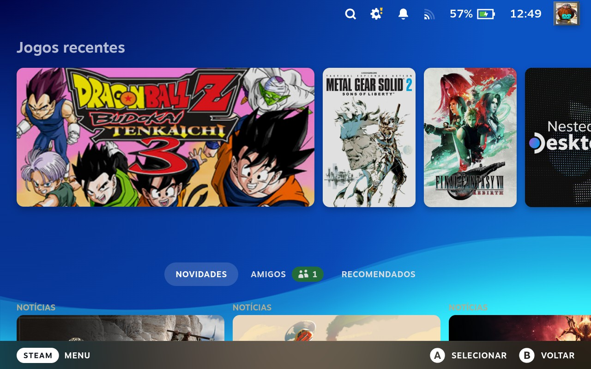
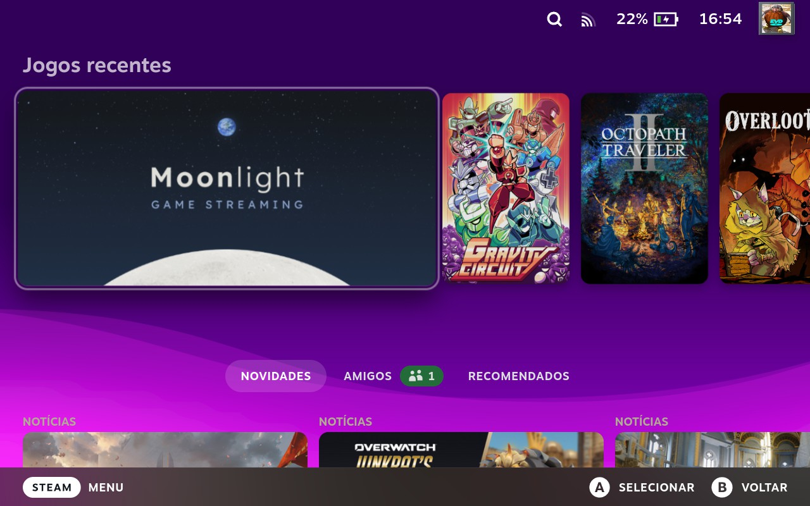
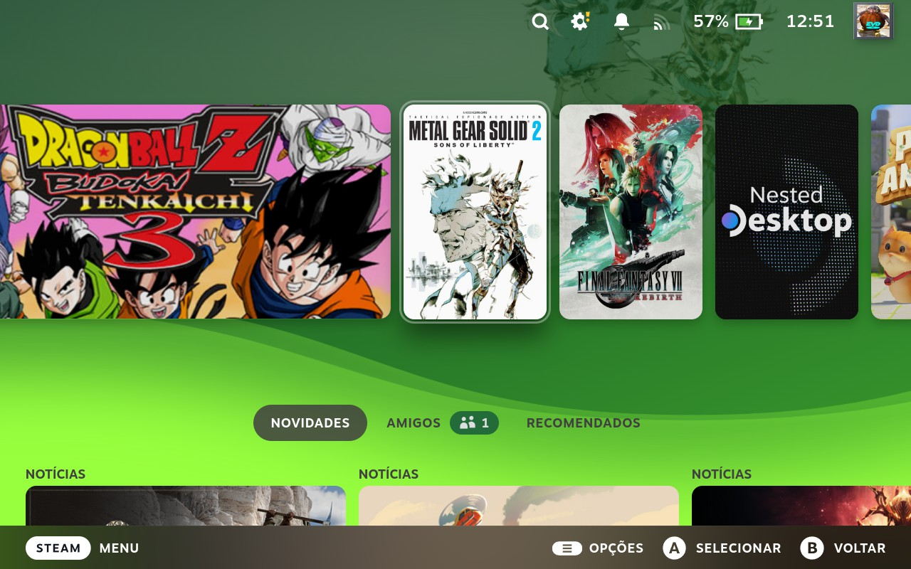
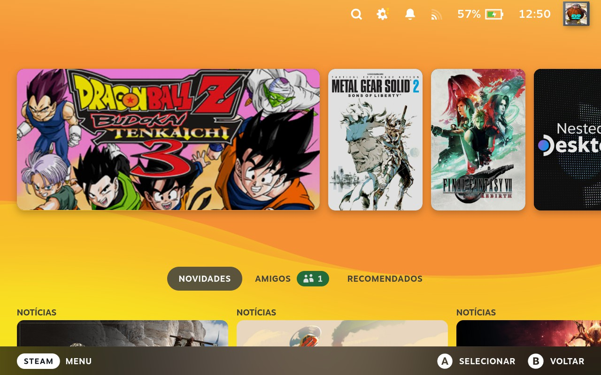
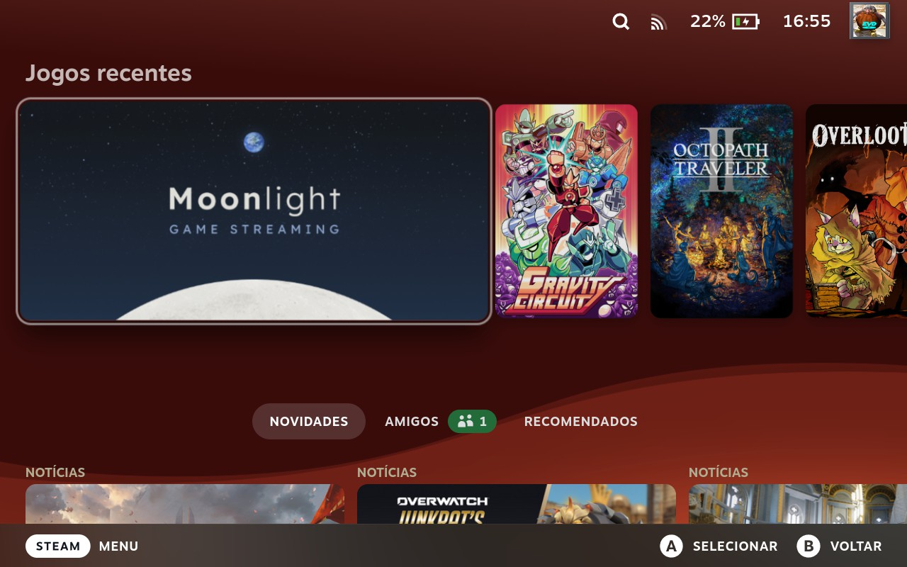
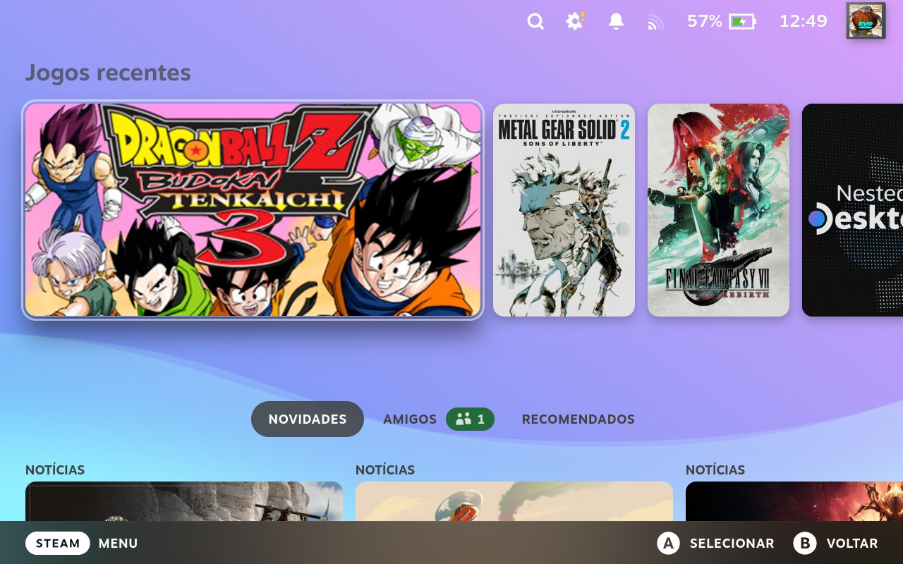

# Animated PSP Waves Background

A dynamic animated background theme for the Steam Deck inspired by the classic PSP (PlayStation Portable) XMB menu background themes

This is an unofficial fan-made theme inspired by the PSP XMB.
PlayStation and PSP are trademarks of Sony Interactive Entertainment.
This project is not affiliated with or endorsed by Sony.

## Live Preview

Click any image to open a live preview of the theme

  
  
  
  
  
  

## 🎮 Interactive Live Preview

Before installing, you can customize and test all color combinations, wave widths, heights, and speeds in real-time directly in your browser:

[👉 Click here to open the Interactive Customizer Preview](https://guilh3rm3ss.github.io/steamdeck-psp-waves-theme/preview.html)

## Technologies Used

*   **CSS:** Used as the main styling language for the background colors, layers, and animations.
*   **SVG (Scalable Vector Graphics):** Utilized to render the Wave images.

## Future Plans

*   ~~**More Color Palettes** ~~
*   **Classic PSP Theme** 
*   ~~**More natural wave movements**~~
*   ~~**Decrease Steam Deck performance impact**~~

## Recommended CSS Themes to Use With
*   **Art Hero**

## Installation

This theme is designed to be used with **CSS Loader** on the Steam Deck.

1. Install **Decky Loader** on your Steam Deck.
2. Open the Decky plugin menu and install the **CSS Loader** plugin.
3. Download the latest release zip file.
4. Extract the file and put the theme folder into your CSS Loader themes directory (usually located at `~/homebrew/themes/`).
5. Open the CSS Loader menu on your Steam Deck and enable **Animated PSP Waves Background**.
